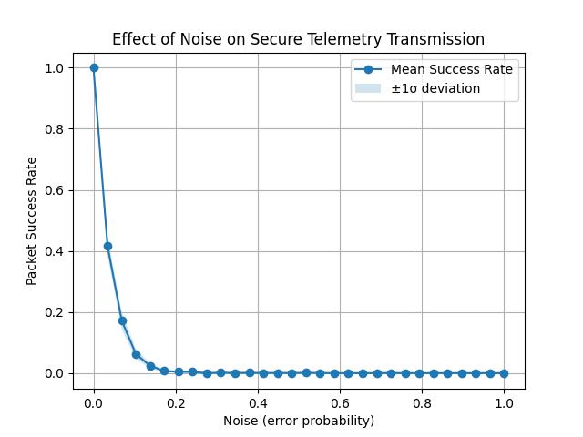

# Secure Telemetry Transmission Simulation using XOR Encryption and CRC-8 Integrity Check

**Author:** Nafim Ershad Inan  
**Date:** November, 2025  

---

## Abstract

This project simulates secure telemetry communication between an aircraft and a ground station. The system employs a **lightweight XOR-based cipher** to ensure data confidentiality and a **CRC-8 checksum** to detect corruption during transmission. A random noise model introduces character-level errors to emulate a noisy communication channel. 

---

## Background and Motivation

Telemetry links in UAVs and small satellites operate in **noisy, bandwidth-limited, and power-constrained** environments. Implementing full-scale encryption or complex error correction is often infeasible on low-end embedded processors.  

This study demonstrates how simple yet effective mechanisms—**XOR encryption for confidentiality** and **CRC-8 for integrity**—can be combined to form a lightweight secure telemetry protocol.

---

## Methodology

### 1. Data Generation
The system generates random aircraft telemetry packets:
```text
<altitude (m)>, <speed (m/s)>, <heading (deg)>
```
Each packet is approximately 21 characters long.
Example: 
```text
10052.75,268.11,142.37
```

### 2. Encryption (XOR Cipher)
A class has be created for the encryption and decryption of the packets. The encryption is done by the following:

```python
encrypted = xor.encrypt(packet)
```
This provides lightweight symmetric encryption suitable for resource-limited systems.

### 3. Integrity Check (CRC-8)
After encryption, a CRC-8 checksum is computed and appended:
```python
packet_crc = add_crc8(encrypted)
```
CRC-8 uses the polynomial:

$x^8 + x^2 + x + 1$ (0x07)

which is a standard, hardware-friendly choice for 8-bit integrity checks.

### 4. Noise Simulation
Channel noise is modeled by randomly replacing characters in the packet with printable ASCII characters at a configurable error rates:

```python
noisy = add_noise(pkt, error_rate)
```
This simulates transmission corruption caused by interference or bit flips.

### 5. Verification and Decryption
**On the receiver side:**<br>
CRC-8 is verified using `verify_crc(packet)`. If valid, the encrypted payload is decrypted using the same XOR key.
If invalid, the packet is flagged as corrupted.

## Experimental Setup
| Parameter      | Description                     | Value     |
| -------------- | ------------------------------- | --------- |
| Trials         | Packets per simulation run      | 200       |
| Noise range    | Error probability per character | 0.0 – 1.0 |
| Packet length  | 21                              | —         |
| Encryption key | `"key123456789"`                | —         |
| CRC polynomial | `x⁸ + x² + x + 1` (0x07)        | —         |

Each packet was independently encrypted, transmitted through a noisy channel, and verified at the receiver. The simulation was repeated for various and random noise probabilities to determine the packet success rate (fraction of correctly received packets).

## Result

*Figure 1: Efffect of Noise on Secure Telemetry Transmission*

**Interpretation**:
The packet success rate drops sharply even for small noise values (error rate ≈ 0.05).
This is expected since any single-bit corruption invalidates the CRC.

Beyond error rate ≈ 0.2, the success rate approaches zero, showing CRC’s high sensitivity to noise.

The results closely match the theoretical packet survival probability:

$$
P_{\text{success}} = (1 - \text{error})^L
$$

where L is the average packet length.

## Discussion

The simulation confirms that **CRC-8** effectively detects corruption but offers no correction capability.
In noisy environments, the probability of receiving uncorrupted packets decays exponentially with noise level due to the independence of character errors.

While the **XOR cipher** ensures confidentiality, it provides limited cryptographic strength. However, its simplicity and low computational cost make it suitable for educational purposes and resource-limited embedded systems.

For real-world telemetry systems, stronger algorithms such as **AES-128** or **AES-256** for encryption and **Hamming(n,k)** or **Reed-Solomon** codes for error correction would be recommended.

## Conclusion

This project implemented a complete secure telemetry transmission simulation using **Python**.
It successfully demonstrated the interplay between:

- Encryption (XOR Cipher for confidentiality)
- Integrity protection (CRC-8 checksum)
- Noise simulation (random character corruption)

The system behaves consistently with theoretical expectations—showing exponential decay in packet success rate as channel noise increases.
This work establishes a foundation for further exploration into lightweight cryptographic and error-control mechanisms for UAV and satellite communication.

## References

- Koopman, P. (2002). 32-bit cyclic redundancy codes for Internet applications. DSN 2002.

- Stallings, W. (2017). Cryptography and Network Security: Principles and Practice. Pearson.

- NASA (2018). Telemetry Systems Engineering Handbook. NASA/TM–2018-219952.

- CRC Polynomial List — RevEng CRC Catalogue (https://reveng.sourceforge.io/crc-catalogue/all.htm
)

- Wikipedia
    - CRC (https://en.wikipedia.org/wiki/Cyclic_redundancy_check)
    - XOR Cipher (https://en.wikipedia.org/wiki/XOR_cipher)
